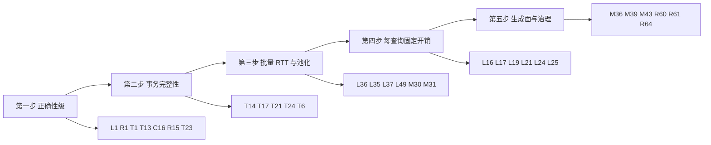

# PalORM 性能与可靠性优化点全量审计（mimo26flash · 五轴合并版）

> 复核注记（2026-09-22）：本报告部分头条经复核被证伪或与既有裁决冲突（L1 继承自 mimo26pro 的扩容病理、L35 的"全仓无 Prepare"、M36 与 ADR-I、R33 与 `AnalysisLevel` 裁决），实施前请对照 `docs/review/性能优化任务清单-2026-09-22.md` §六 与 §九。

## 元信息

| 项 | 内容 |
|----|------|
| 日期 | 2026-09-22 |
| 范围 | src/PalORM.Core 全部 43 源文件、三 Provider、SourceGen 8 个 Emitter（含生成产物快照核对）、SessionBatch、GridReader、事务链路 |
| 方法 | 6 路并行逐行深读（事务会话核心 / SQL 构建缓存 / 批量写入 / Provider 与通知 / 弹性横切 / SourceGen 生成面），与既有 `性能优化审计-mimo26pro.md`（68 点）交叉合并去重；头条行号 16/16 抽验核真 |
| 编号 | 沿用 mimo26pro 原编号 T1-T12 / C1-C10 / L1-L15 / M1-M17 / R1-R14（68 点保留）；本轮新增接续 T13+ / C11+ / L16+ / M18+ / R15+ |
| 总量 | **208 点**：事务 24 · 并发 23 · 延迟 50 · 内存 45 · 可靠性 66 |
| 标注 | [事实] 行号处代码可直接确认；[推断] 效果量级/触发概率需实测 |
| 交叉收敛 | 本轮独立复现既有头条：R1≈S-12、T1≈S-2/S-32/S-43、C4≈X-1、M1≈Q-25、M11≈P-16 等，双模型独立收敛提高置信度 |

## 一、头条先修（前 15）

| # | 编号 | 位置 | 问题 | 轴 |
|---|------|------|------|----|
| 1 | L1 | ValueStringBuilder.cs:48 | 超 4KB 精确扩容，大 SQL 构建 O(n²) 拷贝 | 延迟/内存 |
| 2 | R1 | PgNotificationListener.cs:235-255 | keepalive 双定时器竞态，空闲监听器静默死亡（双模型独立收敛） | 可靠性 |
| 3 | T1 | DataSession.Transactions.cs:149,267 | 主路径 CommitAsync 无超时上界，网络黑洞永久挂起（4 处，Provider 已有 CommitWithTimeoutAsync 而 Core 无） | 事务 |
| 4 | T13 | DataSession.Crud.cs:125-143 | 单条 Insert/Save 生成 ID 立即回填，事务回滚后实体持悬空 ID 再 Save 走 UPSERT 打空 | 事务 |
| 5 | C12 | DataSession.Query.cs:135-140 | 原生 Query/Scalar/Execute 入口读路由完全不生效，长流式枚举冻结整个会话 | 并发 |
| 6 | C16 | DataSession.cs:383-388 | ExecuteWithResilience 绕过操作门禁，打破单活动操作契约（亦是 C4 熔断竞态的触发前提） | 并发 |
| 7 | L36 | DataSession_Bulk.cs:683-684 | BatchUpsert 硬编码 900 参数上限，PG/MySQL 65535 被钳到 900，10K 行 223 次往返 | 延迟 |
| 8 | T23 | MySqlProvider.cs:298-311 | MySQL BulkCopy 失败路径无显式有界回滚，依赖驱动 Dispose 隐式语义 | 事务 |
| 9 | M18 | SessionOperationState.cs:141-143 | 事务流无条件 new TCS+List，与操作侧惰性化不对称 | 内存 |
| 10 | R15 | DataSession.cs:228 | 读连接 OpenAsync 不链 ConnectionTimeout，ct==default 可无界挂起 | 可靠性 |
| 11 | T6 | DataSession.Transactions.cs:236 等 | 回滚超时槽位混用 CommandTimeout，配置 0 时 30 秒有界回滚保护静默失效（三处同根） | 事务 |
| 12 | L35 | MultiValueBulkInsert.cs:214-266 | 批量跨批稳定 CommandText 全仓无一处 Prepare | 延迟 |
| 13 | R35 | DataSession.Query.cs:11 等 | Count/Query/Scalar/Get/GetAll 直连家族无拦截器无指标，系统性少计 | 可靠性 |
| 14 | M36 | PalORM_Runtime.cs:16-48 | legacy 载荷运行时零消费仍每次 Register 合并常驻 | 内存 |
| 15 | C20 | PalORM_Runtime.cs:220-241 | Register 锁内对全部 16 字段无条件 Merge+ToFrozenDictionary 重建 | 并发 |

## 二、事务操作的完整可靠性（T1-T24）

既有 T1-T12 见 mimo26pro 审计（T1 提交无界 / T2 资源静默丢弃 / T3 BulkMerge ID 悬空 / T4 批量部分失败 / T5 DbBatch 无超时 / T6 回滚槽位混用 / T7 收口 5 分钟 / T8 冲突只暴露首行 / T9 ToPageAsync 骨架游离 / T10 重试参数复用 / T11 Data 键散落 / T12 savepoint 同名覆盖）。其中 T10 本轮经 Q-9 独立复核升级为 SELECT 默认走重试的真实路径（QueryBuilderExtensions.cs:148,193 同批参数实例跨尝试 Add）。

- **T13** [轴5] DataSession.Crud.cs:125-129、138-143、164-170、409 | 单条 Insert/Save 语句成功即把生成 ID 回填进调用方实体；WithTransaction 中后续步骤回滚后，实体仍持已不存在行的 ID，再 SaveAsync 因 HasDefaultKey=false 改走 UPSERT/UPDATE 打向不存在主键。与 T3（Bulk 层）同根但覆盖面是全部 CRUD 调用方 | 事务存在时延迟回填、提交成功统一回放（复用 bulk 的 deferred 模式），或回滚时恢复旧值 | [事实]回填时序 /[推断]复用后果
- **T14** [轴5] DataSession.Crud.cs:241-243 | 单条 UpdateAsync 语句成功即抬内存 version；外部事务回滚后内存与 DB 分叉，重试必撞假 ConcurrencyConflictException——deferred 清单（:245）只有批量调用方在用 | 会话存在任何活动事务时统一走 deferred | [事实]立即回填分支 /[推断]假冲突场景
- **T15** [轴5] DataSession.Transactions.cs:83-84 + SessionOperationState.cs:130-137 | 嵌套 WithTransaction/BeginTransaction 一律硬拒，不降级 savepoint，内层多步逻辑无"部分成功原子隔离"手段 | 外层事务存在时内层自动 SAVEPOINT/ROLLBACK TO 语义 | [事实]拒绝路径 /[推断]设计方向
- **T16** [轴5] DataSession.Transactions.cs:21-69 | savepoint API 只有 SAVEPOINT 与 ROLLBACK TO，缺 RELEASE SAVEPOINT——长事务反复开点不释放，无法表达"内层成功并入外层" | 补 ReleaseSavepointAsync | [事实]API 面
- **T17** [轴5] DataSession.Schema.cs:78-125 | MigrateAsync 无外层事务：表批成功后任一索引 DDL 失败留半成品 schema，靠幂等重跑收敛；MySQL DDL 自动提交无法包事务，PG/SQLite 本可包 | PG/SQLite 用事务包全程，MySQL 维持幂等收敛并文档声明 | [事实]无事务包裹 /[推断]
- **T18** [轴5] DataSession.Transactions.cs:253-256、274-281 | RunInTransactionScopeAsync 复用外部事务（ownsTransaction=false）时 work 失败既不回滚也不标记，外部事务内部分失败对 Bulk 家族完全无痕 | 主异常 Data 追加"事务未回滚（复用外部事务）"提示 | [事实]分支
- **T19** [轴5] DataSession_Bulk.cs:668-671 | 批内重复主键语义三方言不一致：MySQL last-wins、PG/SQLite 单语句内报错（注释登记为未定义边界） | 入口按 PK 检测重复显式失败或先去重，方言分歧收敛为单一行为 | [事实]
- **T20** [轴5] DataSession_Bulk.cs:642-657 | v5.6.0 分区改变执行顺序：默认键行先全部逐条插入完才批量 upsert 非默认键行，输入交错顺序被重排，实体间外键依赖输入顺序时可能失败 | 文档化执行顺序契约或按输入顺序分组提交 | [事实]重排 /[推断]外键后果
- **T21** [轴5] PostgreSqlProvider.cs:73-74 + MySqlProvider.cs:58-61 | Enlist/AutoEnlist 强制 false 后依赖 TransactionScope 的调用方静默脱离环境事务（ITM-643），环境回滚不作用于已执行的 DB 工作且无错误信号 | 检测 TransactionScope.Current 非空时抛出或警告 | [事实]
- **T22** [轴5] CommandFactoryEmitter.cs:356-360、404-406 | MySQL 发射单 CommandText 双语句 `...; SELECT LAST_INSERT_ID()`：autocommit 下 INSERT 提交先于取 ID，连接中断即"行已插入、ID 未取回"，重试造成重复插入；PG RETURNING 单语句无此窗口 | 文档标注原子性窗口，或自增键插入提示包显式事务 | [事实]emit 形态 /[推断]触发概率
- **T23** [轴5] MySqlProvider.cs:298-311 | BulkCopy 路径失败的 catch 只记 primaryException 即重抛，无 PG 路径（PostgreSqlProvider.cs:339-341）的显式有界回滚，回滚完全依赖 finally 中事务 Dispose 的驱动隐式语义，无超时上界、无 RollbackTimeoutException 挂载 | 对齐 PG：catch 内显式有界回滚并挂主异常 Data | [事实]
- **T24** [轴5] MultiValueBulkInsert.cs:90 + DataSession.Transactions.cs:267 + MySqlProvider.cs:294 | 提交尝试接受 ct：取消落在 COMMIT 窗口时服务端最终状态未知，主异常为 OCE，提交是否生效需查 Data 键；MySQL 已有 CommitWithTimeout 包装，Core 两处没有 | Core 提交统一 CancellationToken.None + 固定超时，取消只作用于 work 阶段 | [事实]状态未知边界

## 三、增加并发（C1-C23）

既有 C1-C10 见 mimo26pro（C1 BulkDelete 串行合并 / C2 BulkMerge 逐条 / C3 乐观锁排除批量 / C4 熔断读序 / C5 重试无 jitter / C6 单活动硬失败 / C7 通知同步分发 / C8 GridReader 钉会话 / C9 咨询锁钉池 / C10 StoredProc 竞态）。C4 本轮经 X-1 独立复现（CircuitBreaker.cs:54-57 先读 flag 后读 generation），C7 经 S-19 复现并确认 A3 改造未落地。

- **C11** [轴1] SessionOperationState.cs:75-83 | 单活动操作门禁使同一会话任意两操作（含纯读与写）完全互斥，一次慢读阻塞后续所有操作；读路由已有独立 `_readConnection`（DataSession.cs:36-43）却仍共用这把全局独占租约 | 无活动事务且配置读路由时允许读操作并发持有租约（读走独立物理连接，写仍独占） | [事实]
- **C12** [轴1] DataSession.Query.cs:135-140 | QueryAsyncEnumerable/QueryAsync/ScalarAsync/ExecuteAsync 经 CreateCommand() 恒走主连接，读路由完全不生效；长流式枚举全程占住主连接与租约，会话整体冻结到流结束 | 无事务时原生入口接入 _readConnProvider | [事实]/[推断]收益
- **C13** [轴1] DataSession.cs:173-192 | PreWarmAsync 串行 for 逐条 Open+Initialize（自述远程建连 ~8.5ms/条），count=100 独占 0.85s 启动时间 | SemaphoreSlim 有界并行（8 路）打开 | [事实]串行 /[推断]
- **C14** [轴1] DataSession.cs:390-396 | WithTimeout/WithRetry/WithCircuitBreaker 配置变更经独占租约：任一飞行操作在场即抛，运行期调配置被门禁拒绝 | 一致性已由 :404-405 Volatile.Write 承担，改为不占租约的原子发布 | [事实]抛出路径 /[推断]放宽安全性
- **C15** [轴1] DataSession.cs:215-223、197-201 | `_readConnection` 读-判-建-写全程无锁无 volatile，正确性完全依赖单操作租约契约；GetRawConnection 逃生舱绕过门禁后可并发触碰同一字段与主连接 | 赋值走 Volatile/Interlocked，或逃生舱文档声明互斥责任在调用方 | [事实]
- **C16** [轴1/轴4] DataSession.cs:383-388 | ExecuteWithResilience 不经门禁直接 Volatile.Read(_resilience).ExecuteAsync：公开入口可与内置管线并发，打破单活动操作契约，让 ResilienceExecutor/CircuitBreaker 出现真实并发（C4 竞态的前提），也绕过与配置变更的互斥 | 纳入门禁，或文档声明该入口允许多线程并发并据此加固熔断快路径 | [事实]
- **C17** [轴1] QueryBuilderExtensions.cs:32-36、209-210 | 查询结果缓存 TryGet 未命中后直接执行并 Set，无 singleflight：同键高并发 miss 全部打到数据库（惊群），完成后各自 Set | 热点键按 key 信号量合并穿透 | [事实]无合并 /[推断]收益
- **C18** [轴1] CacheStore.cs:148、91-110 | Set 每次用 `_cache.Count >= _maxEntries` 容量判断，ConcurrentDictionary.Count 是全分段锁扫描，高并发写入唯一全局争用点；ObservableGauge 回调在锁内再读 Count，指标采集与缓存构造互斥 | Interlocked 近似计数（注释 25-26 已自荐未落） | [事实]
- **C19** [轴1] CircuitBreaker.cs:105-122 | RecordSuccess 无条件进全局锁：熔断从未开启、_failureCount=0 的干净连胜稳态，每次成功操作仍拿一次 _lock | 锁外快路径：非探针、flag=false 且 failureCount==0 直接返回 | [事实]
- **C20** [轴1] PalORM_Runtime.cs:155-156、184-187、220-241 | Register 在全局 _registrationLock 内全量重建：fragment 未触及的字段也 Merge+ToFrozenDictionary（16 字段恒定重建）并含 ToHashSet/OrderBy 锁内分配，多模块并行注册互相阻塞 | 仅重建 fragment 命中字段，其余复用 current 引用 | [事实]
- **C21** [轴1] PgNotificationListener.cs:87-90 + NpgsqlNotificationConnection.cs:25-37 | 监听连接默认池化，整个监听生命周期租占一个池位，N 个监听器在小 MaxPoolSize 下挤压业务查询连接；原始连接串还绕开 Provider 调优 | 监听专用连接串强制 Pooling=false | [事实]
- **C22** [轴1] PgNotificationListener.cs:497-509 | NotifyAsync 每次发送走 Open+Execute 两段，高频发送方每条通知付一次连接租借与会话建立；零重试，瞬时抖动下通知静默丢失 | 提供复用连接的 notify 重载 + 短重试 + NotifyManyAsync 合并往返 | [事实]
- **C23** [轴1] PostgreSqlProvider.cs:236-302 | 批循环单连接串行执行每个 COPY（Npgsql 协议约束），整批吞吐上限为单会话带宽 | 大数据量按实体分片多连接并行 COPY（需评估分片原子性与外层事务协调） | [事实]串行 /[推断]方案

## 四、降低延迟（L1-L50）

既有 L1-L15 见 mimo26pro（L1 VSB 扩容 / L2 批量 UPDATE MB 级 / L3 MySQL BulkCopy 重建 / L4 负结果不缓存 / L5 Upsert 无三件套 / L6 短末批退化 / L7 BuildLimitClause 双遍 / L8 QuoteIdentifier / L9 COUNT/UPDATE 无形状缓存 / L10 分页 COUNT / L11 COPY object 分派 / L12 ReadFirstAsync 推进 / L13 ColumnOrderValidator / L14 批量双快照 / L15 LISTEN 重建）。

- **L16** [轴2] DataSession.Crud.cs:334-348、364-384；DataSession.Query.cs:30-31、97-98 | GetAsync/GetAllAsync/CountAsync/聚合每次在调用点分配 async lambda 闭包+委托+状态机，默认无重试的直通路径也照付——P2-1 直调优化（DataSession.cs:626-643，实测 208B/行）只覆盖写路径 | 直通分支先判 IsPassThrough 直接执行 | [事实]/[推断]量级
- **L17** [轴2] DataSession.cs:606、639、653 | 每条查询固定 3 次 _sync 锁 + 2 次 GetActiveTransaction（Enter→CreateCommand→执行前再判），IsTransactionAlive 触碰事务 Connection 属性（Npgsql 上可能抛 ODE 再被吞） | "是否有事务"随租约或命令缓存一次 | [事实]/[推断]微秒级
- **L18** [轴2] DataSession.cs:611 + Crud.cs:118/162/226/271/282/426、Query.cs:26/94/137/194/264/281 | CreateCommand 已集中设 CommandTimeout，几乎所有调用点再写一遍同值（注释自认"防御冗余"） | 删冗余写，测试锁定工厂行为 | [事实]
- **L19** [轴2] DataSession.Crud.cs:368-372 | GetAllAsync 每次重建整句 SQL：QuoteIdentifier+插值拼接；同文件 GetGetByKeySql（:307-319）已有全句缓存先例 | 补 per-(Type, Dialect, filter) 全句缓存 | [事实]
- **L20** [轴2] DataSession.Query.cs:17-23 | CountAsync 基础句 `SELECT COUNT(*) FROM {tbl}` 每次拼接（基底恒定，仅条件可变） | 基底按 (Type, Dialect) 缓存 | [事实]
- **L21** [轴2] DataSession.cs:659-671 | Count/Query/Scalar/Execute/聚合族每次重跑 FormatSqlWithParameters（FormattableString→@pN 文本解析）+参数循环——formatted 文本只取决于格式串与实参值无关 | 按格式串缓存 formatted SQL，值恒走参数绑定 | [事实]/[推断]
- **L22** [轴2] DataSession.Crud.cs:141 | RETURNING 插入每次 reader.GetOrdinal(pkColumn)（驱动多为字典/线性查找），高 QPS Insert 每行白付 | pkOrdinal 随 CrudMetadata per-dialect 缓存 | [事实]/[推断]微
- **L23** [轴2] DataSession.Crud.cs:478-480、493-494 | 带过滤查询 GetEntityFeatures 字典查两次（GetDefaultFilterForms 一次、HasTenantFilter 内部再一次） | 结果存局部传递 | [事实]/[推断]微
- **L24** [轴2] QueryBuilder.cs:781-793 | 每次 BuildSql 即使命中形状缓存也先遍历全部子句现算 shapeHash，再 FindMatch 逐条核对，命中路径固定付 O(子句数) 哈希+比较 | shapeHash 随 _materializedClauses 缓存，链变更即失效 | [事实]
- **L25** [轴2] QueryBuilder.cs:1221-1225 + MemberResolver.cs:33-35 | 每次 OrderBy/ThenBy/GroupBy/Include/表达式 Where 经 GetQualifiedColumnName 现做表达式模式匹配并插值分配限定列名串，同一（成员,表,方言）恒产出同串但无缓存 | 按 (Type, 成员, source) 缓存限定列名 | [事实]
- **L26** [轴2] QueryBuilder.cs:193 | Select() 用 `members.Select(GetColumnName).ToArray()`：LINQ 委托+迭代器+数组三连分配，每次调用固定开销 | 手写循环预分配（同文件 Raw 已有先例） | [事实]
- **L27** [轴2] QueryBuilder.cs:1133、1154 | 字面量 LIMIT 分支 literalTake.ToString(InvariantCulture) 分配中间串而 VSB 有零分配 Append(int)；`SqlLimits.MySqlOffsetOnlyLimit.ToString(...)` 常量每次调用都分配 | sb.Append(int)；常量提 static readonly | [事实]
- **L28** [轴2] QueryBuilderExtensions.cs:32-34 | 缓存命中每次 `new List<T>(cached)` 全量浅拷贝，大结果集高频命中时 O(n) 拷贝+新 List 是命中路径全部成本（契约 ITM-308 要求新列表） | 契约允许演进时返回共享底层数组的只读快照 | [事实]
- **L29** [轴2] QueryBuilderExtensions.cs:19-21 | EffectiveCacheKey 每次插值拼 `{scope}:{key}` 新串，TryGet 一次、Set 再一次 | builder 内缓存组合键 | [事实]
- **L30** [轴2] StoredProcBuilder.cs:94 | GetOutputValue 的 `_outputParams.Find(x => x.ParameterName == name)` 捕获 name 形成闭包+List 线性扫，执行后每读一次输出参数触发一次 | for 循环消闭包，输出参数字典化 | [事实]微
- **L31** [轴2] BatchUpdateSqlBuilder.cs:143-178 | MySQL/SQLite CASE WHEN 形态 SQL 文本按 O(行数×列数) 平方级增长（每个 SET 列重复全部行 WHEN 分支），单语句可达 MB 级，解析与传输线性膨胀 | 分批阈值从纯行数改为按生成文本字节估算 | [事实]形态 /[推断]字节分批
- **L32** [轴2] PostgreSqlProvider.cs:35-76、MySqlProvider.cs:37,77、SqliteProvider.cs:107-124 | 每次 CreateConnection/InitializeConnection 都 new XxxConnectionStringBuilder 解析全串并重建（每会话一次，高频短会话重复付） | 按（原串+调优参数）缓存调优后连接串 | [事实]
- **L33** [轴2] SqliteProvider.cs:132-138 | 每个新连接无条件全量执行 PRAGMA 集，池复用物理句柄时每会话重复同一组幂等 PRAGMA（多一次多语句往返与解析） | 探测 PRAGMA 状态后跳过或增量执行 | [推断] **2026-09-26 决策不实施**：初始化已是单往返批，探测读取本身 1 次往返，成本≥收益（负优化），见 step5 §九
- **L34** [轴2] SqliteProvider.cs:180 | 批量参数上限硬编码 999，现代 SQLite（3.32+）默认 32766，同数据量最多多约 33 倍语句往返 | ~~运行时 sqlite3_limit 探测或默认 32766 保留 999 回退~~ **[推断] 已实测证伪（2026-09-26）**：32766 臂批量劣化 6~16×（单语句绑定成本超线性），维持 999，见 step5 §九
- **L35** [轴2] MultiValueBulkInsert.cs:214-266 | 跨批复用 batchCmd 在 CommandText 稳定时从不调用 Prepare（全仓 src 无 DbCommand.Prepare 调用，grep 核实），MySQL 回退每批文本协议重解析、SQLite 每批重新 prepare | ~~首批后显式 Prepare，批间仅改参数 Value~~ **[事实] 前提证伪（2026-09-26）**：驱动 CommandText 同值 setter 短路（`if (value != _commandText)` 源码核实），同文本批次本就免重编译，见 step5 §九
- **L36** [轴2] DataSession_Bulk.cs:683-684 | BatchUpsert 硬编码 `maxParametersPerStatement = 900`（SQLite 999 余量），PG/MySQL 实际上限 65535：20 列实体 45 行/批，10K 行 223 次往返（PG 同上限只需 4 批） | 按方言分档钳制，复用 MultiValueBulkInsert 已有 MaxParametersPerStatement 机制 | [事实]
- **L37** [轴2] SessionBatch.cs:119-126 | SQLite 回退路径每条语句 await using DbCommand 新建再销毁，本地 RTT≈0 时命令创建反成回退路径主要开销 | 循环外建一条命令复用（改 CommandText+清参数） | [事实]
- **L38** [轴2] SessionBatch.cs:90-127 | SQLite 无批量 API 回退逐条，但 SQLite 支持单命令多语句（分号分隔）一次往返，当前未用 | 无参语句（AppendRaw）合并为单个多语句命令；带参保持逐条 | [事实]逐条 /[推断]合并
- **L39** [轴2] Resilience.cs:143-147 | 无返回值重载每次分配捕获 operation 的闭包+async lambda 转 Task<bool>，公共入口即分配，直通配置也不例外 | IsPassThrough 时直接 await operation(ct) 短路 | [事实]
- **L40** [轴2] PalORMMetrics.cs:63-88 | Record 内 RecordCount 与 RecordDuration 各自调 CreateTags 构建两份相同 TagList（栈结构无堆分配，纯冗余计算） | 构建一次传两处 | [事实]边际
- **L41** [轴2] DbOptions.cs:27,34-39、294-302 | CommandTimeoutSeconds 计算属性每次访问重跑 Math.Ceiling，CreateCommand 及各路径重复赋值使其每命令被调多次；ToString 每次多段插值（诊断路径） | 改 init 字段由 with 后工厂统一重算；ToString 惰性缓存 | [事实]边际
- **L42** [轴2] QueryBuilderExtensions.cs:158、186-212、206 | Stopwatch 在韧性循环外创建、OnAfter 读 Elapsed：拦截器拿到的 elapsed 含此前失败尝试与退避等待（3 重试约 +700ms），口径未声明 | XML doc 明示含重试总时长，或另供 per-attempt 耗时 | [事实]
- **L43** [轴2] DataSession.cs:636-642 | 非直通写路径每次仍分配捕获 command 的闭包+lambda+AsTask 桥接，仅超时包装需要委托 | 无需超时归一的形态提供零委托直调分支 | [事实]边际
- **L44** [轴2] RowFactoryEmitter.cs:101 | 可空列发射 `r.IsDBNull(o) ? null : r.GetXxx(o)`，每可空列每行两次 reader 访问 | 评估 `GetFieldValue<T?>(o)` 单读（需按驱动验证 null 行为） | [事实]双读 /[推断]
- **L45** [轴2/轴3] RowFactoryEmitter.cs:124 | OwnedJson 发射 `JsonSerializer.Deserialize(r.GetString(o), T)`：每行先分配整段 JSON string，STJ 再从 string 转码 UTF-8 缓冲解析，双重缓冲 | GetFieldValue<byte[]> + Deserialize(ReadOnlySpan<byte>) | [事实]emit 形态 /[推断]收益
- **L46** [轴2] RowFactoryEmitter.cs:162、63-70 | char 列为取 1 个字符先 GetString(o) 分配整串，每行每 char 列一次 string 分配 | 评估 GetFieldValue<char>（驱动支持不一） | [事实]/[推断]
- **L47** [轴2] AutoTaggingEmitter.cs:161-167 | 拦截方法发射 `async ... return await ...X(ct)`，每个被标记调用点多包一层 async 状态机，底层已是 ValueTask 也照包 | 改非 async 直接 return（无 await 无状态机） | [事实]/[推断]
- **L48** [轴2] AutoTaggingEmitter.cs:139、166 | Tag 编译期零分配，但每次查询运行时把源码注释拼进 SQL 文本，opt-in 即承担每查询拼接与文本变长 | 文档标注每查询开销，或 Core 按调用点缓存已标记 SQL 形状 | [事实]/[推断]
- **L49** [轴2] BatchUpdateSqlBuilder.cs:25-70 | Build 每批全量重建 SQL 文本，无任何形状缓存；批量循环中（方言,表,pk,列集,rowCount）相同的相邻批重复构建重复分配 | 按（列集,rowCount,方言）带上限记忆化，对齐 SqlShapeCache 纪律 | [事实]无缓存 /[推断]
- **L50** [轴2/轴4] AuditInterceptor.cs:42-75 | 三个回调全为同步 ILogger 写入且接口无 CancellationToken：Console/File 同步 provider 把审计 IO 直接叠加进查询延迟，审计背压即请求背压 | 文档强制异步 provider，或内置 Channel 后台刷写 | [事实]

## 五、减少内存占用（M1-M45）

既有 M1-M17 见 mimo26pro（M1 ShapeCache 无界 / M2 SqlShapeCache 重复条目 / M3 BoundedQueryCache 拒写 / M4 ParameterNameCache 1.3MB / M5 每查询 CTS+定时器 / M6 Stopwatch 分配 / M7 SessionBatch 参数双倍 / M8 version 逐行闭包 / M9 BulkDelete 装箱键 / M10 心跳悬挂定时器 / M11 GridReader TCS / M12 占位符短命串 / M13 QueryBuilder struct 拷贝 / M14 WhereIn 装箱 / M15 零散小分配群 / M16 COPY CTS / M17 Audit 装箱）。

- **M18** [轴3] SessionOperationState.cs:141-143 | 每个事务流无条件 new TCS + new List（_activeTransaction 无任何等待者也建），与同文件操作侧 TCS 惰性化（:89、:214-224）不对称 | 惰性创建（首个等待者出现时再建） | [事实]/[推断]微
- **M19** [轴3] DataSession.Crud.cs:53-54 | 租户生效时每次 From<T> 走 FormattableStringFactory.Create 分配 FormattableString+槽位数组，tenantId 装进 object[] | 与 GetDefaultFilterForms（:491-513）同样按 (Type, Dialect, tenant) 缓存成串 | [事实]
- **M20** [轴3] DataSession.Transactions.cs:107-116 | 无返回值 WithTransaction 每次多包一层 async 委托 + ValueTask→Task→ValueTask 双桥（:107-109 注释自认） | 热路径共享 static 包装或直通重载消双跳 | [事实]
- **M21** [轴3] SessionOperationState.cs:87 | 每次 Enter 都写 _currentOperationOwner.Value（AsyncLocal 赋值触发执行上下文拷贝）；Exit 侧已优化不写（:536-537 注释 -300B），Enter 侧仍是每操作固定 EC 拷贝 | 以代次/租约对象判定 scope 替代 AsyncLocal 首写 | [事实]/[推断]
- **M22** [轴3] SessionBatch.cs:27、56 | _statements（SQL 串+参数数组）无上限增长，万条 Append 全程驻留到 Dispose | 软上限或文档提示分批 | [事实]/[推断]
- **M23** [轴3] DataSession.Schema.cs:50、66 | ValidateSchemaAsync 用 LINQ Where 闭包包 HashSet 查重（每调用一显示类）；DiffAsync（已 Obsolete）再叠 Select+ToList | foreach 直写；DiffAsync 按 PALORM901 计划 v6 移除 | [事实]/[推断]微
- **M24** [轴3] QueryBuilder.cs:338、658 | 每个 Set 子句和键集续页比较用集合表达式 `[parameter]` 分配单元素数组装参数列表 | 复用单元素数组模板或改传参形状 | [事实]微
- **M25** [轴3] QueryBuilder.cs:1196 | BuildLimitClause 以 `return (sb.ToString(), [.. parameters])` 把 List 再展开成数组，多一次拷贝 | 直接返回 List 或预建数组 | [事实]微
- **M26** [轴3] QueryBuilder.cs:1018-1025 | GetParametersForKinds 按全量 _parameterCount 预分配 List 容量，按 kinds 过滤后 COUNT 路径大半闲置 | 按选中类别预估容量 | [事实]
- **M27** [轴3] SqlShapeCache.cs:52-55 | GetBucket 在 src 与 test 全仓库无调用点（grep 仅命中定义行），internal 死成员 | 删除 | [事实]
- **M28** [轴3] ValueStringBuilder.cs:101 | Return 归还池数组未传 clearArray:true，SQL 文本残留共享池（残留表名/结构/Raw 片段，参数值不进文本） | 含用户 Raw 内容场景可选 clear | [事实]低危
- **M29** [轴3] CrudMetadata.cs:62-64、154-159 | CrudColumns 构造每列集 ToArray+Array.AsReadOnly 双层分配，Copy() 再全套重复，一次 Copy 至少 6 次分配（低频） | 冷路径可接受；热路径出现则复用只读引用 | [事实]
- **M30** [轴3] DataSession_Bulk.cs:456-457、467 | PrepareBatchUpdateContext 每次执行 `metadata.UpdateColumns.Select(QuoteIdentifier).ToArray()`+new record，列集跨调用不变 | 按类型缓存引号列名数组与上下文 | [事实]
- **M31** [轴3] DataSession_Bulk.cs:742-761 | BuildUpsertSqlShape 每次调用 LINQ Where/Select+string.Join 构造 UPDATE 列串与冲突子句 | 按 (Type, Provider) 缓存 UpsertSqlShape | [事实]
- **M32** [轴3] DataSession_Bulk.cs:642 | `List<T> upsertBatch = new(entities.Count)` 按全量预分配，全默认键（逐条插入）时分配 N 容量后恒空 | 惰性分配 | [事实]
- **M33** [轴3] DataSession_Bulk.cs:790-797 | SeedAsync 先 entities.ToList() 全量副本，再 items.Any 完整遍历校验，BulkMerge 再遍历两遍 | 校验合并进 BulkMerge 首遍分区循环 | [事实]
- **M34** [轴3] PgNotificationListener.cs:391、361 | 每条 NOTIFY 分配 PgNotificationEventArgs，RaiseError 每次分配调用列表数组；B6 已消掉热路径分发数组，事件 args 是剩余项 | 高吞吐提供 (channel, payload) 直通回调重载 | [事实]
- **M35** [轴3] SqliteProvider.cs:133、135 | cache_size=-65536 每连接页缓存上限 64MB，池内 N 个物理连接潜在总内存 64MB×N（按需触达） | 文档标注内存足迹与池大小关系或提供配置项 | [事实]
- **M36** [轴3] PalORM_Runtime.cs:16-20、44-48、224、233 | legacy 载荷 CommandSqls 与 CreateTableSql 运行时从不消费（注释自认），每次 Register 被 Merge 进新 state 常驻：旧生成器整套 CRUD/DDL 字典永久驻留零收益 | Register 时丢弃 legacy 载荷，或文档声明保留代价与容量上界 | [事实]
- **M37** [轴3] QueryBuilderExtensions.cs:171-175 | 注释自认可剥离的每查询 104B（async 局部函数委托 56B+display class ~250B）未实施，实测耗时无变化仅分配收益 | 按注释既定方案改 struct 内核+泛型约束 | [事实]
- **M38** [轴3] CommandFactoryEmitter.cs:474-482 | 绑定值全部显式 `(object)` 装箱（快照核实）；OwnedJson 每行 JsonSerializer.Serialize 产新 string 再装箱 | 装箱为 ADO.NET 固有；JSON 列评估 SerializeToUtf8Bytes 按 G31 方言分支 | [事实]装箱 /[推断]byte[] 方案
- **M39** [轴3] MigrationEmitter.cs:26-35 | 三方言 CREATE TABLE 常量与三组索引数组恒定全量嵌入，单方言应用另两族是元数据死载荷（与 RegistryEmitter 已登记的 27% SQL 死载荷同族） | MSBuild 属性选择目标方言集仅 emit 在用方言 | [事实]
- **M40** [轴3] MigrationEmitter.cs:46、49 | 发射 `static readonly string[]` 索引数组：引用固定但元素可写 internal 可见，运行时已用防御性克隆兜底（ITM-204），静态数组本体仍是可写残留 | emit IReadOnlyList<string> | [事实]/[推断]篡改风险低
- **M41** [轴3] RegistryEmitter.cs:116-133 | draft.BindInsert/BindUpdate/BindDelete 与 CrudBindings 内同名绑定各发一份匿名 lambda，每实体两套等价委托 | AddChunk 局部变量承接一次发射两处复用 | [事实]
- **M42** [轴3] RegistryEmitter.cs:182-186 | PropertyToColumn 发射可变 Dictionary 初始化器，运行时再 ToFrozenDictionary 复制冻结，启动期每实体双份物化 | 消费项目 TFM 允许时直接 emit FrozenDictionary 或 KVP 数组 | [事实]/[推断]TFM 需确认
- **M43** [轴3] RegistryEmitter.cs:110-114 | 每实体 3 方言 CommandSqlSet 全量载荷，单方言应用跨方言族 UPDATE/DELETE/RETURNING 死载荷，且三份内容仅引号差异 | 方言选择性 emit | [事实]
- **M44** [轴3] RegistryEmitter.cs:138-152、179-180 | insert/upsert/update 三组列名数组+ColumnNames 槽最多 4 份独立 new[]{...}，insert 与 update 列序相同仍重复两份 | 内容相等复用同一数组引用 | [事实]低量级
- **M45** [轴3] PalORM_Runtime.cs:94-147 | public 属性各自独立 Volatile.Read(ref _state)，多属性连续访问多次内存屏障；CurrentState 快照（:91）已有但仅内部使用 | 文档引导组合场景走 CurrentState 快照 | [事实]边际

## 六、增加可靠性（R1-R66）

既有 R1-R14 见 mimo26pro（R1 keepalive 竞态 / R2 重连 5 次死亡 / R3 GridReader 无 faulted / R4 释放竞态 / R5 重试不复核熔断 / R6 写不计熔断 / R7 墙上钟 / R8 双快照 / R9 Dispose 后 Append / R10 注册重入缓存陈旧 / R11 缓存共享可变 / R12 FromEnvironment 静默 / R13 审计丢堆栈 / R14 哨兵无导出面）。

- **R15** [轴4] DataSession.cs:228 | 读路由连接 OpenAsync 只吃调用方 ct，不似 CreateAsync（:94-96）链 ConnectionTimeout——ct==default 时读连接建立可无界挂起 | 补 CreateLinkedTokenSource(ct)+CancelAfter(ConnectionTimeout) | [事实]
- **R16** [轴4] GridReader.cs:120；SessionOperationState.cs:424；DataSession.cs:409 | Dispose/等待族 API 全部不接 CancellationToken，5 分钟上限内调用方无法主动中止 | DisposeAsync 增加可选 ct，或缩短默认等待+分级诊断 | [事实]
- **R17** [轴4] SessionOperationState.cs:230-241 + DataSession.Transactions.cs:184-185、293 | 事务收口等活动操作超时后仅挂 Data（或被 WithTransaction catch），finally 随即 DisposeTransactionPreserving——在飞操作可能仍持该事务命令引用，事务被并发释放 | 超时分支阻止释放并显式失败，或等待期间先向在飞操作传播取消 | [事实]流程 /[推断]后果
- **R18** [轴4] SessionOperationState.cs:479-507 | 会话 Dispose 等 5 分钟超时后仍 disposeCore 关主连接（ITM-665 有意为之），在飞操作连接被抽走 | 同 R17：先取消在飞操作再收连接 | [事实]已文档/[推断]
- **R19** [轴4] DataSession.cs:467；SessionOperationState.cs:203、240 | 清理异常入 Data 用 `$"...{Data.Count}"` 推导索引，主异常 Data 已有任意键时索引漂移；固定键二次赋值静默覆盖丢前一个 | 会话内递增计数器唯一后缀，赋值前 ContainsKey | [事实]模式 /[推断]概率
- **R20** [轴4] TransactionCleanup.cs:48-57 | 跳过回滚只认 OCE/TimeoutException/IOException/SocketException 四型——驱动把客户端超时包装成不含四型的裸 DbException 时误判"服务端已处理"跳过显式回滚 | 增加驱动特定超时判定（MySqlTimeoutException 等），实测三方言锁定白名单 | [推断]
- **R21** [轴4] DataSession.cs:649-656 | 读弹性重试只重放 attemptCore：命令在同一可能已断的 _conn 上重建再发，连接级瞬时故障（IsTransient 判真）时重试 N 次注定失败，纯放大延迟 | 重试循环检测 State 断开则复用 CreateAsync 逻辑重建 | [事实]无重连 /[推断]收益
- **R22** [轴4] DataSession.cs:232-237 | 读连接建立/初始化失败直接抛，无回退主连接降级——读副本抖动让全部读路由查询失败而主库健康 | 失败降级主连接一次并记 Warning | [事实]throw /[推断]
- **R23** [轴4] GridReader.cs:216-220 | QueryObservation 只在 DisposeAsync 或读异常时 Complete；拿到 GridReader 后既不读也不 Dispose → Activity 永不收尾、租约不还 | 租约/观测加泄漏诊断（Debug 检测超期未收尾） | [事实]收尾点两处 /[推断]
- **R24** [轴4] DataSession.Query.cs:125-131、143-151 | 流式枚举器租约全程持有且无超时，手写 GetAsyncEnumerator 忘 Dispose 即永久占会话（ITM-508 契约明示，5 分钟超时仅兜底 Dispose 一处） | 枚举租约超时中断或泄漏检测 | [事实]已文档/[推断]
- **R25** [轴4] SessionBatch.cs:82、155-160 | _disposed 布尔无锁 check-then-act：并发 Execute 与 Dispose 时 _scratch 可能在 CloneParameter 途中被释放 | 加锁保护或文档声明线程不安全+开发期断言 | [推断]
- **R26** [轴4] QueryBuilderExtensions.cs:18-21 + CacheStore.cs:188 | 查询结果缓存键只做租户前缀化，不含方言与连接库维度；进程级 CacheStore.Default 跨方言会话共享时同类型同键命中另一方言库数据（ITM-558 只堵类型不匹配维） | key 组装补方言维度，或多方言进程文档强制注入独立 QueryCache | [推断]单方言低危
- **R27** [轴4] QueryBuilderExtensions.cs:253-254 | OnError 拦截器异常被 catch{} 吞掉只递增计数，异常对象丢弃，审计故障现场不可回溯（ERR-010 仅补计数） | 保留最近 N 个异常引用或日志钩子 | [事实]
- **R28** [轴4] StoredProcBuilder.cs:9-10、112-151 | 存储过程执行完全绕过 IQueryInterceptor、Tracing、Metrics 与弹性重试（ITM-582 登记），审计对存储过程调用永久盲视 | 补 opt-in 观测入口对齐三段式管线 | [事实]已文档
- **R29** [轴4] CircuitBreaker.cs:169-178 | ReleaseCancelledProbe 把 _openUntil 置 UtcNow 使冷却立即到期：短超时频繁取消探针时每次取消都让下一请求立即成为新探针，Open 态退化为串行探针流 | 取消只释放槽位保留剩余冷却+探针取消次数上限 | [推断]
- **R30** [轴4] Resilience.cs:81-126 | 无整体 deadline：每次尝试独立拿满 _timeout，最坏总时长=(maxRetries+1)×CommandTimeout+Σbackoff（默认 30s 配 3 重试约 90 秒+），调用方不传 ct 时无处配置总预算 | 增加总超时配置，或 XML doc 明示最坏时长公式 | [事实]
- **R31** [轴4] Resilience.cs:74、96-101 | 公开 ExecuteAsync 对操作幂等性无运行时防护，超时 OCE 可重试意味着服务器可能已执行，非幂等写交进来即重复写入，契约仅靠 XML doc（ITM-310） | 显式开关（allowRetry=false 直通）或分析器/调试断言 | [事实]
- **R32** [轴4] AuditInterceptor.cs:7-11 | 覆盖面缺口自认：INSERT/DELETE/Bulk/存储过程不经拦截器，审计轨迹对写入操作系统性缺失 | 按 R3 对 ExecuteAsync 同法补写路径三段式，或给 DB 层审计指引 | [事实]
- **R33** [轴4] PalORM.Core.csproj:15-16 | NoWarn 含 CA2007（ConfigureAwait）且 AnalysisLevel=latest-minimum：比 latest-all 少 338 条诊断，ConfigureAwait 配对从编译器强制退化人工纪律 | 恢复 CA2007 或按行白名单抑制，按账本逐批收敛 | [事实]
- **R34** [轴4] DataSession.Query.cs:286-295 | R3 三段式 NotifyInterceptorsOnBefore 在 try 之外调用：OnBefore 抛异常无人收到 OnError，而 SELECT/UPDATE 管线 OnBefore 在 try 内（QueryBuilderExtensions.cs:195,543），同接口两条接入点失败语义不一致 | OnBefore 移入 try 对齐 | [事实]
- **R35** [轴4] DataSession.Query.cs:11、185、259 + DataSession.Crud.cs:322、352 | grep 证实 CountAsync/QueryAsync/ScalarAsync/GetAsync/GetAllAsync 直连家族既无拦截器三段式也无 WithTracing/WithMetrics，审计与 palorm.query.* 指标对这批入口系统性少计 | 补齐文档，或为只读直连家族接 QueryObservation 与三段式 | [事实]
- **R36** [轴4] QueryBuilderExtensions.cs:153、180、206 | StartActivity 之后、try 之前调用 builder.GetActiveTransaction()：显式绑定事务失效时必抛（QueryBuilder.cs:577-587，ITM-524/640），异常在 try 外，Activity 无人 Dispose 污染 Current 链，finally 的 metrics Record 不执行、该次失败从指标静默消失（与已修 ITM-625 同形态） | GetActiveTransaction 提前到 StartActivity 之前，或观测启动纳入 try/finally | [推断]
- **R37** [轴4] QueryBuilderExtensions.cs:447-451 | QueryMultipleAsync 先 StartObservation 后 Enter 门禁（try 之外）：门禁拒绝时 observation 已创建无人 Complete，Activity 悬挂且指标缺失 | Enter 提前到 StartObservation 之前 | [推断]
- **R38** [轴4] QueryBuilderExtensions.cs:545 | UPDATE 管线直接 command.ExecuteNonQueryAsync(ct) 不走超时归一：驱动超时不被包成 TimeoutException+Data["PalORM.InfrastructureTimeout"]，而 DataSession.ExecuteAsync 写路径归一化，同一写超时两路径类型不同 | UPDATE 复用 ExecuteWithTimeoutAsync 或抽共享归一助手 | [事实]
- **R39** [轴4] DataSession.cs:197-202 | DisposeConnectionSafelyAsync 空 catch 吞掉连接释放异常且无计数挂点（对比 OnError 有 InterceptorOnErrorFailures 计数），池归还失败静默丢失 | Interlocked 失败计数或诊断通道 | [事实]
- **R40** [轴4] DataSession_Bulk.cs:334-339 | 乐观锁冲突抛 ConcurrencyConflictException 消息只有实体类型名，不含主键值与输入序号；逐条路径首行即抛，调用方无法定位冲突实体 | 异常附主键值（SensitiveData 掩码评估）与输入下标 | [事实]
- **R41** [轴4] DataSession_Bulk.cs:345、543 | 批量与逐条（无乐观锁）对"行不存在/被并发删除"返回 0 行静默累加，total < entities.Count 时不抛不警，部分更新无信号 | 文档化口径为契约，或可选 affected != expected 告警开关 | [事实]
- **R42** [轴4] BulkOperationFramework.cs:39-46 | ProbeBinderAsync 的 ct 无消费点（binder 与 CreateCommand 同步），探测期间取消不生效（ITM-784 登记） | 维持登记，探测引入可取消 IO 时接入 | [事实]
- **R43** [轴4] BulkOperationFramework.cs:75-82 | 能力探测失败（local_infile 探测异常）仅进程内计数，无日志无事件，降级到慢约 4.84 倍的多值路径完全静默，生产须主动轮询才知道"突然变慢" | 一次性 Warning 钩子或 EventSource 事件 | [事实]
- **R44** [轴4] MySqlBulkCopyInserter.cs:151-162 | Warnings 非空即抛（防静默截断✓）但异常只报总数与首个 Warning 错误码，其余 N-1 个错误码丢失 | 按 ErrorCode 分组汇总计数（不回显值） | [事实]
- **R45** [轴4] MySqlBulkCopyInserter.cs:163-165 | 服务端不报行数时 RowsInserted=-1 规范化为 end-start，假设本批全部插入成功，返回值可能高估（ITM-656 已注释） | 维持登记；精确对账用事务+外部计数，文档明示口径 | [事实]
- **R46** [轴4] MySqlBulkCopyInserter.cs:45-46 + EntityDataReader.cs:45-52 | 取消检查点在批间，批内 EntityDataReader.Read() 驱动同步拉行无取消点；batchSize 调大后单批取消延迟=整批序列化时间 | 维持批间检查点（默认 1000 行窗口小），大 batchSize 文档提示取消粒度 | [事实]
- **R47** [轴4] PostgreSqlProvider.cs:40-74 + MySqlProvider.cs:51-61 | 全部连接串覆盖判据用"当前值==驱动默认值"，用户显式设成默认值的意图被改写（MaxAutoPrepare=0、ConnectionLifetime=3600、ServerRedirectionMode=Disabled 等）；布尔显式不可区分已登记 PROV-011 | 改用 DbConnectionStringBuilder.ContainsKey（键集只含显式出现的键） | [事实]
- **R48** [轴4] PostgreSqlProvider.cs:64-65 | NoResetOnClose=true 使归池连接跳过 DISCARD ALL，raw SQL 的 SET/临时表状态泄漏给下一池租客（ITM-652 登记的取舍），泄漏无任何错误信号 | 提供显式关闭调优旁路，或会话初始化检测残留状态告警 | [事实]
- **R49** [轴4] PostgreSqlProvider.cs:362-380 | QuotedInsertTargetCache 用 TryAdd 无占位，首次并发访问同类型时两个线程都完整构建（含 LINQ+string.Join），一份被丢弃 | GetOrAdd(Lazy) | [事实]低
- **R50** [轴4] PostgreSqlProvider.cs:196-201 + MultiValueBulkInsert.cs:52-57 | InsertBinderValidated 无锁双检，首次并发各跑一次 ProbeBinderAsync，多付一次探针往返 | Interlocked 或 Lazy 初始化 | [事实]低
- **R51** [轴4] PgNotificationListener.cs:228、335-341 | 重连成功即清零计数，"每心跳周期失败一次"型故障（LB 定期掐线）永不清零也永不升级，无限重连抖动，且每次重连窗口内服务端 NOTIFY 不投递、静默丢失 | 重连频率窗口统计并升级告警 | [事实]
- **R52** [轴4] PgNotificationListener.cs:319-341 | ProbeConnectionAsync 吞掉全部非 OCE 异常仅返回 false，CreateKeepaliveFailure 构造异常不带 inner，心跳失败真实根因（超时/复位/协议错）全部湮灭 | 探测异常作 inner 传递并 Debug 留痕 | [事实]
- **R53** [轴4] PgNotificationListener.cs:343-377 | LastError 只在无 OnError 订阅者分支写入，存在订阅者时监听死亡后 LastError 仍为 null，轮询方误读为健康态 | 两分支统一先写 LastError 再分发 | [事实]
- **R54** [轴4] PgNotificationListener.cs:168 | StartAsync 无自身超时地 await started.Task，上界只依赖连接串 Timeout（驱动默认 15s，可设 0）与调用方 ct | 启动等待加显式超时转 TimeoutException | [事实]
- **R55** [轴4] PgNotificationListener.cs:481-493 | StopCoreAsync 无界 await runTask，RunAsync 收尾若卡在损坏连接的 DisposeAsync（黑洞网络），StopAsync 与 DisposeAsync 随之挂起 | 停止等待加超时并记录，超时后仍释放 CTS | [事实]
- **R56** [轴4] NpgsqlNotificationConnection.cs:126-131 | WrapConnectionException 只包装 NpgsqlException 按 IsTransient 标记，Open/Wait 抛出的非 Npgsql 瞬时异常（IOException 等）不带 PalORM.IsTransient，被监听器判非瞬时直接终止 | IO/socket 类异常同样包装标记 | [事实]
- **R57** [轴4] NpgsqlNotificationConnection.cs:98-112 | ProbeAsync CommandTimeout 硬编码 10 秒与心跳间隔无联动；注入小于 10s 的 keepaliveInterval 时探测耗时可超过间隔，叠加 CTS 单次取消语义放大 R1 | 探测超时取 min(间隔/2, 上限) 并参数化 | [事实]
- **R58** [轴4] MySqlProvider.cs:51-61、74-75 | ConnectionLifeTime==0 必被改写为 PoolLifetimeMinutes×60（PG 侧显式 0 可保留，两 Provider 行为分叉）；ServerRedirectionMode 判据恰为驱动默认值 | ContainsKey 判据统一两 Provider 覆盖口径并登记 | [事实]
- **R59** [轴4] AdvisoryLockExtensions.cs:93-102 | EnsureInTransaction 是检查后使用两步：判定与随后 ExecuteAsync 之间事务被他线程提交/回滚，锁在隐式事务边界静默失效而方法正常返回 | 并入 SessionOperationState 操作门禁做原子断言 | [推断]
- **R60** [轴4] CommandFactoryEmitter.cs:112-133 | BindDelete 对 null 键调 Convert.ToInt64(key) 返回 0，null 主键静默转 0 绑定；decimal 等走 Convert.ChangeType 经 IConvertible 装箱转换 | null 键抛 ArgumentNullException，整型键 key switch 消除 ChangeType | [事实]
- **R61** [轴4] CommandFactoryEmitter.cs:436、457 | 并发令牌参数直接 `p.Value = entity.Cc` 绕过 GetParameterValueExpression：无 Converter.ToProvider、无 DbType 提示、无 null 归一，与其他列不对称 | 并发令牌同走 GetParameterValueExpression 单一真源 | [事实]emit 不对称/[推断]Converter 场景
- **R62** [轴4] CommandFactoryEmitter.cs:164-171 | SetId 对 int 主键发射 `(int)id` unchecked，DB 自增值超过 Int32.MaxValue 环绕为负写回实体 | 转换前溢出检查抛 OverflowException | [事实]/[推断]溢出才触发
- **R63** [轴4] CommandFactoryEmitter.cs:37 | JsonTypeInfo 静态字段初始化 `?? throw`，metadata 缺失抛出被 CLR 包成 TypeInitializationException 且该包装被类型永久缓存 | 挪到首次绑定路径检查，抛原始 InvalidOperationException | [事实]/[推断]缓存语义
- **R64** [轴4] RowFactoryEmitter.cs:124 | OwnedJson 发射 `Deserialize(...)!` 抑制可空：DB 返回 JSON 文本 null 时属性写入 null 引用，NRE 延迟到消费处且无列名上下文 | 判 null 抛带列名的 InvalidOperationException（同 ReadChar :63-70 模式） | [事实]/[推断]触发条件
- **R65** [轴4] RowFactoryEmitter.cs:92-96 | ITM-536 自登记缺口：可空判定源自 NRT 注解，实体文件 #nullable disable 时 string 列不生成 IsDBNull 守卫，DB NULL 直接抛驱动 SqlNullValueException 且无列名 | DDL nullability 与守卫生成交叉校验，对"DDL 可空但无守卫"列发编译期诊断 | [事实]
- **R66** [轴4] AutoTaggingEmitter.cs:119、57-70 | TryGetReturnType 失败与 ExtractTarget 各 null 分支静默 continue/return null，调用点丢失标签零诊断（注释自认 fail-safe）：SQL 定位静默退化 | 跳过的调用点发射 Warning 诊断 | [事实]

## 七、负结论（核查过确认无问题，防重复立项）

- **同步 IO**：全仓 grep 零 `.Result`/`.Wait()`/`GetAwaiter().GetResult()`；连接全走 OpenAsync/CloseAsync/DisposeAsync。
- **lock 跨 await**：SessionOperationState/GridReader 所有 lock 均同步块，await 在锁外；单锁设计无锁顺序死锁面。
- **CancellationToken 泄漏**：范围内无 `token.Register(` 未释放；CTS 全部 using/finally Dispose；取消令牌全部真正传入 ADO.NET 调用。
- **写路径重试非幂等**：ExecuteWriteRowsAsync 只做超时包装不重试；CreateAsync 重试仅围绕幂等建连；事务内重试已硬性关闭（QueryBuilderExtensions.cs:85,182 + DataSession.cs:639,653 以 boundTransaction is null 为韧性前置）。
- **GridReader 观测双计数**：QueryObservation.Complete 有 Interlocked.Exchange 幂等保护。
- **形状缓存键完备性**：ShapeFields 已含 Dialect/TableName/CteName/Split/HasTake/HasSkip/TakeLiteral 加子句值相等核对；租户与 DefaultFilter 同点冻结；QuoteIdentifier 方言固定不进键。
- **注册表发布**：锁内构造完整不可变 state 后单次 Volatile.Write 原子交换，无撕裂。
- **指标无界**：标签三元有界字面量，TagList 栈结构无装箱，Record 由 _metrics 门控默认可关。
- **事件订阅泄漏**：监听器订阅与解除配对（含 Open 失败路径）。
- **EntityDataReader**：按序号直读参数池无每行分配；GetBytes/GetChars 显式拒绝。
- **ToPageAsync 事务骨架**：commitAttempted 裁决、RollbackPreservingAsync 保留根因、finally 先还原再释放，未发现缺陷。
- **MultiValueBulkInsert 提交裁决 / BulkOperationFramework 异常保留 / 批量自开事务原子性（PG COPY、MySQL BulkCopy 分块）**：结构健全。
- **既有良好状态**（沿 mimo26pro 第八节，防重复立项）：ValueStringBuilder 整体设计、ParameterNameCache、子句持久化链表、位掩码路由、ExecuteWriteRowsAsync 直调、满批参数池、跨批复用三件套、注册表单次发布、TrySkipRollback 保守裁决、有界回滚框架本身。

## 八、落地顺序

- 第一步全是小改动大收益（一到十行级）；L1/R1/T1/T13/C16 五项优先。
- L16/L17/L21/L24/L25 一组属每查询固定机械开销，落地前按 PERF_MANAGED_DISCIPLINE 同会话交替配对 A/B 实测（量具四问先过）。
- C11/C12 读路由并发化是行为契约变更，属架构级决策，需用户裁决后实施。
- 未做 S3 反向验证的条目保持 [推断]，不得写入规范；优化落地后重录基线。
