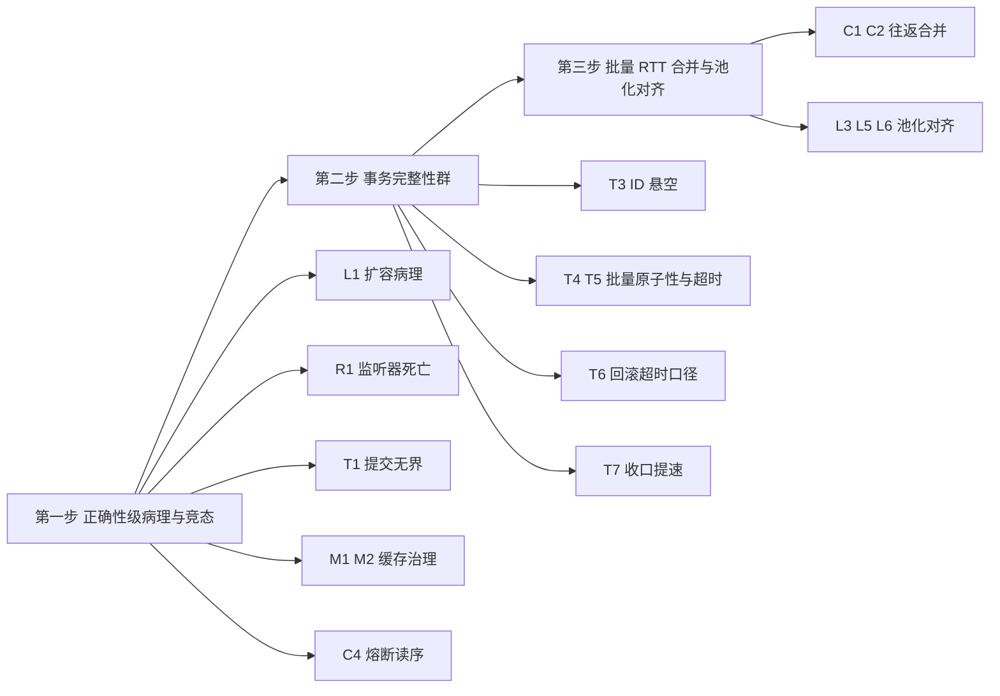

# PalORM 性能与可靠性优化点全量审计（mimo26pro）

## 元信息

| 项 | 内容 |
|----|------|
| 日期 | 2026-09-22 |
| 范围 | src/PalORM.Core 全部 44 个源文件、三 Provider（Sqlite / MySql / PostgreSql）、SessionBatch、GridReader、事务链路 |
| 方法 | 热路径与事务链路（DataSession 全家族、SessionOperationState、TransactionCleanup）人工逐行精读；SQL 构建/缓存、批量/弹性、Provider/连接层三路并行深读交叉核实 |
| 整理模型 | mimo-v2.6-pro（文件名标识 mimo26pro） |
| 标注约定 | [事实] = 引用代码可直接确认的行为或分配；[推断] = 效果量级或触发概率的估计，落地前需实测 |
| 收录口径 | 68 个点：事务完整性 T1-T12（12）、并发 C1-C10（10）、延迟 L1-L15（15）、内存 M1-M17（17）、可靠性 R1-R14（14） |

## 一、总体结论

本库已经过至少七轮深度分配优化（ValueStringBuilder、位掩码子句路由、子句持久化链表、参数名缓存、批量参数池、注册表单快照、WriteRows 直调重载等均已到位），SQL 生成本身压得很紧。剩余问题集中在四类：

1. 正确性级别的性能病理：大 SQL 构建在 4KB 以上退化为 O(n²) 拷贝（L1）。
2. 缓存家族的容量与键设计缺陷：两个缓存在长运行进程中分别表现为内存无界增长（M1）与容量冻结（M2）。
3. 事务主路径的提交无超时上界（T1），而同一问题在 Provider 批量路径已经修过，主 API 未对齐。
4. PG 通知监听器的一个定时器竞态会让空闲监听器静默死亡（R1）。

最大的剩余收益集中在每查询固定机械开销与缓存治理，其次才是批量路径的往返合并。

## 二、头条发现（先修这 10 个）

| # | 位置 | 问题 | 轴 |
|---|------|------|----|
| 1 | ValueStringBuilder.cs:48 | 超 4KB 后逐次精确扩容，大 SQL 构建退化为 O(n²) 拷贝 | 延迟/内存 |
| 2 | PgNotificationListener.cs:235-255 | keepalive CTS 单次取消语义 + 双定时器竞态，空闲监听器可能 30 秒后静默死亡 | 可靠性 |
| 3 | DataSession.Transactions.cs:149, 267 | WithTransaction / RunInTransactionScopeAsync 的 CommitAsync 无超时上界，网络黑洞下永久挂起 | 事务 |
| 4 | FormattableSqlFormatter.cs:26-33 | ShapeCache 键含 BaseIndex 且无上限，动态查询进程单调内存增长 | 内存 |
| 5 | SqlShapeCache.cs:76-94 | Add 不查重、计数先行，重复条目侵蚀 1024 上限直至缓存冻结 | 可靠性/内存 |
| 6 | CircuitBreaker.cs:54-57 与 Open 写序 | Enter 快路径先读 flag 后读 generation，竞态下刚开闸的熔断器被旧操作立即关闭 | 可靠性/并发 |
| 7 | DataSession_Bulk.cs:593-643 | BulkMerge 中途失败后已回填的自增 ID 悬空，仅文档防护无机制 | 事务 |
| 8 | MultiValueBulkInsert.cs:90、SessionBatch.cs:96 | SQLite 全部批量与 MySQL 回退批量的 COMMIT 无超时；DbBatch 路径无 CommandTimeout 面 | 事务 |
| 9 | GridReader.cs:174-243 | Dispose 等 5 分钟超时后与活动读取并发释放 reader，属 ADO.NET 未定义行为 | 可靠性 |
| 10 | DataSession_Bulk.cs:219 | 批量 UPDATE 每批行数只受参数上限约束，单条 SQL 可达 MB 级 | 延迟/内存 |

## 三、事务操作的完整可靠性（T1-T12）

T1. 主路径提交无超时上界 [事实]。DataSession.Transactions.cs:149（WithTransaction）与 :267（RunInTransactionScopeAsync）的 `transaction.CommitAsync(ct)` 只受调用方取消令牌约束。ADO.NET 的事务提交不受 CommandTimeout 治理，`ct == default` 时网络黑洞会让提交永久挂起。对照证据：PG/MySQL Provider 批量路径已为同一问题专门实现 `CommitWithTimeoutAsync`（注释原文：此前 ct == default 时提交无界等待），事务主 API 未对齐。建议把 CommitWithTimeoutAsync 收敛进 TransactionCleanup 供全库共享，WithTransaction、RunInTransactionScopeAsync、ToPageAsync 的提交统一走它，超时口径沿用 CommandTimeout，Zero 契约保持不变。

T2. 事务资源注册在外事务流时静默丢弃 [事实]。SessionOperationState.cs:149-166 的 `RegisterTransactionResource` 只在当前异步流持有事务时加入列表，其余情况整个方法静默返回。调用方认为资源已被事务收口管理，实际永远不会被 DisposeTransactionResourcesAsync 释放。建议非注册场景抛明确异常或返回 bool，与库整体响亮失败哲学对齐。

T3. BulkMerge 自增 ID 悬空 [事实：仅文档防护]。DataSession_Bulk.cs:593-596 的 ITM-556 注记承认：中途失败整批回滚后，已回填的内存 ID 对应的行不存在于 DB，靠调用方不要用的文档约定。同文件 Update 路径已用 deferredVersionIncrements 把 version 回填延迟到提交后，Merge 的 ID 回填没有对等机制。建议同样延迟回填到提交成功后，或失败路径把已回填 ID 重置回默认值。

T4. 批量执行部分失败无原子性选项，完成度不可诊断 [事实]。SessionBatch.cs:115-127 回退路径逐条执行，第 k 条失败时前 k-1 条已生效，异常里不带已完成 k/n 信息；DbBatch 路径驱动侧同样可能部分应用。建议异常 Data 挂已完成语句数，并提供 EnsureAtomic 选项在无活动事务时自动开事务包裹。

T5. DbBatch 执行无超时约束 [事实]。SessionBatch.cs:96-98 注释自认 DbBatch/DbBatchCommand 无 CommandTimeout 面（经 .NET 10 参考程序集核对属实）。PG/MySQL 首选批量路径恰恰无超时，SQLite 回退路径反而有。建议用 ExecuteWithTimeoutAsync 风格的纯超时包装兜底，或探测 NpgsqlBatch/MySqlBatch 的专有超时属性逐命令设置。

T6. 回滚超时槽位混用命令超时值 [事实：口径不一致]。PostgreSqlProvider.cs:340 与 MultiValueBulkInsert.cs:104 把 `commandTimeoutSeconds` 传进 `RollbackPreservingAsync` 的 `rollbackTimeoutSeconds` 槽。DataSession.Transactions.cs:236 同样按 Zero 契约透传，但那是有文档的显式裁决；另两处属槽位语义混用。后果：用户为命令设置超时 0（无限）时，R3 专门建立的 30 秒有界回滚保护被静默关闭。建议 `<=0` 时回退 DefaultRollbackTimeoutSeconds（30s），仅正值透传。

T7. WithTransaction 内未释放 GridReader 的收口代价 [事实：机制存在；[推断]：触发频率]。RollbackTransactionPreservingAsync（DataSession.Transactions.cs:197-232）已具备绕门禁直接回滚的兜底（ITM-693），但前置是 WaitForActiveOperationPreservingAsync 等满 DisposeWaitTimeout（默认 5 分钟），且回滚时连接上仍有活跃 reader，驱动可能再次拒绝。收口从可能永久死锁改进到 5 分钟后尽力而为，对交互式服务仍然过慢。建议事务收口等待走独立的较短超时，超时后先尝试取消活动读取（配合 R4 的 linked CTS）再回滚。

T8. 乐观锁批量冲突只暴露首行 [推断：重试成本]。DataSession_Bulk.cs:334-339 每行判定 version，首个冲突即抛并整批回滚。万行批量里有 3 行冲突时调用方每轮只发现一行，需 O(冲突数) 轮往返才能拿全。建议可选收集模式：跑完全部行汇总冲突集后抛聚合异常，事务照常回滚。

T9. ToPageAsync 事务骨架游离于共享内核 [事实：文档承认]。DataSession.Transactions.cs:245-247 的注释说明 ToPageAsync 有意不走 RunInTransactionScopeAsync。两套 commit/rollback/RestoreTransaction 链各自演化，是 T1 这类修一处漏一处的结构性温床。建议至少把提交与回滚两个收尾动作抽成共享助手，骨架差异保留在文档里。

T10. 重试路径复用同一组 DbParameter 实例 [推断：边缘]。QueryBuilderExtensions 的重试循环跨尝试绑定同一批参数对象，若驱动在绑定时推断 DbType 或截断 Size，第二次尝试携带被污染的参数。主流驱动不改用户值，风险低。建议文档登记该契约，或重试前重绑。

T11. Exception.Data 键名是散落的字符串字面量 [事实]。`PalORM.RollbackException`、`PalORM.RollbackGateException`、`PalORM.RollbackSkipped`、`PalORM.RollbackTimeoutException`、`PalORM.TransactionCleanupException`、`PalORM.TransactionResourceCleanupException`、`PalORM.CleanupException{N}` 等 10 余个键散在 6 个文件里。消费方按键取诊断信息的代码与实现之间无编译期关联。建议收敛为常量类（同 SqlLimits 单点纪律）。

T12. Savepoint 同名覆盖无提示 [推断：小]。SavepointAsync 允许重复名。PG 语义下同名 SAVEPOINT 是替换旧保存点而非嵌套，回滚目标悄悄改变。建议文档注明或检测重复名给出警告。

## 四、增加并发（C1-C10）

C1. BulkDelete 串行往返可合并 [事实：基础设施已存在]。DataSession_Bulk.cs:63-116 每 500 个主键一次 ExecuteNonQueryAsync 串行执行，10 万键等于 200 次串行 RTT。SessionBatch 已实现单往返合并（实测 PG 3.4 倍），BulkDelete 未使用。建议多个 IN 批次追加进 SessionBatch 一次执行，远程场景延迟近线性下降 [推断]。

C2. BulkMerge 默认键行逐条插入 [事实]。DataSession_Bulk.cs:643-654 自增 ID 行逐条 SaveCoreAsync，每行一次 RTT。建议 PG 用多值 INSERT ... RETURNING 按序回填（结果集顺序与 VALUES 行序一致，可精确还原 ID）；MySQL 用 LAST_INSERT_ID 步长推导；不需要 ID 回填的调用方提供 opt-in 批量路径。

C3. 乐观锁实体被排除出批量路由 [事实]。DataSession_Bulk.cs:205-214 带 ConcurrencyCheck 的实体走逐条路径，BulkUpdateBatchAsync 直接抛 NotSupportedException。批量形态可以表达逐行版本匹配（`WHERE id = v.pk AND version = v.ver`）。建议提供单语句批量加冲突时回退逐条定位的混合路径，无冲突场景 N RTT 降为 1 [推断]。

C4. CircuitBreaker Enter 读序竞态 [事实：读序如代码]。CircuitBreaker.cs:54-57 快路径先读 `_isOpenFlag` 后读 `_generation`，Open() 先写 flag 后写 generation。线程 A 读到 flag=false 之后、读到新 generation，用它调 RecordSuccess 会把刚开闸的熔断器直接关闭，resetAfter 冷却失效。建议交换两个读的顺序（先读 generation 再读 flag），一行修复。低概率高危害 [推断]。

C5. 重试无抖动，恢复期惊群 [事实]。Resilience.cs:149-155 默认退避是确定性 100→200→400ms 指数退避。故障恢复瞬间所有客户端的重试对齐到达，可能再次打垮刚恢复的服务。建议默认加 full jitter（Random.Shared 取 0 到 delay 之间），文档同步 DbOptions.RetryBackoff。

C6. 单活动操作契约硬失败无排队选项 [事实：设计取舍]。SessionOperationState.cs:75-83 重叠操作直接抛 InvalidOperationException。单连接语义本身正确，但偶发重叠（如后台清理撞上主查询）会让调用方整个请求失败。建议提供可选的 OverlappingOperationPolicy.Wait(timeout) 模式（TCS 基础设施已有），并在异常消息里提示使用独立 DataSession 实现并发。

C7. PG 通知事件分发阻塞监听泵 [事实]。PgNotificationListener.cs:379-403 分发在泵任务线程上同步执行，一个慢订阅者可同时冻结通知接收与断线感知。建议泵线程只入队（有界 Channel），独立任务派发，保留同步事件作兼容路径。

C8. GridReader 存活期间钉死整个会话 [事实]。GridReader.cs:27-39 持有操作租约直到释放，期间会话任何其他操作失败。建议文档显著标注，提供 SkipRemainingAsync 提前收尾 API，长驻流式场景引导用 QueryAsyncEnumerable。

C9. 咨询锁阻塞获取钉住池连接 [事实：文档自认]。AdvisoryLockExtensions.cs:34-58 锁等待期间调用方各钉一个池连接与一个开启中的事务，pg_advisory_xact_lock 不受 statement_timeout 治理。建议提供带 timeout 的重载（SET LOCAL lock_timeout 后取锁），文档给出池容量与锁等待的配比警示。

C10. StoredProcBuilder 执行标志竞态 [事实：文档自认非线程安全]。StoredProcBuilder.cs:22, 155-164 `_executed` 读改写无同步，并发双调用双双通过后参数被两个命令瓜分。建议 Interlocked.Exchange 一行加固，把竞态失败从驱动怪异常变为精确契约异常。

## 五、降低延迟（L1-L15）

L1. ValueStringBuilder 超 4KB 的扩容病理 [事实：机制确认]。ValueStringBuilder.cs:48 的增长公式 `Max(Min(len*2, 4096), required)` 在缓冲超过 4096 后，`Min(len*2, 4096)` 恒为 4096，任何小追加都退化为恰好按需增长：Rent 新数组、全量 CopyTo、Return 旧数组，每次小 Append 重复一遍。具体形态：2000 值的 WhereIn（约 24KB SQL 由几千次小 Append 组成）触发数百次全量拷贝，总拷贝量 O(n²)。M8 的翻倍封顶修复引入了比原问题更差的病理。建议增长策略改为 `Max(required, len + len/2)`（1.5 倍摊还，无封顶），或封顶只作用于首次从栈切池的跳变。一行修复，大 SQL 构建拷贝次数从 O(n/增量) 降为 O(log n) [推断：量级]。

L2. 批量 UPDATE 单语句 MB 级文本 [事实：按字符数计算]。DataSession_Bulk.cs:219 `rowsPerBatch = MaxBindParameters / (setCols+1)` 只受参数上限约束，3 个 SET 列时 16383 行/批，CASE WHEN 形态单条 SQL 约 1.3MB。客户端构建、驱动解析、服务端解析全线性膨胀。BulkInsert 有 1000 行独立上限，UPDATE 路径缺同款钳制。建议 rowsPerBatch 再取 Min(, 1000 到 5000 可配)。

L3. MySQL BulkCopy 每批重建命令与重跑 probe [事实]。MySqlBulkCopyInserter.cs:99-129 rowCommand 在 ExecuteBatchAsync 内，每批一次 CreateCommand/Dispose 加全量 Binder probe。PG 侧同型问题已修（PostgreSqlProvider.cs:219-221 的 M2 优化注释），MySQL 未对齐。建议照 PG 把 rowCommand 与校验上提到批循环外。

L4. local_infile 探测负结果不缓存 [事实]。MySqlProvider.cs:224-231 变量不存在时直接 return 不写缓存，TTL 窗口内每次 BulkInsert 多付 1 次 SHOW VARIABLES 往返。建议探测成功完成（含无行）即缓存 true/false，仅异常不缓存。

L5. BatchUpsertAsync 无池化绑定器，逐批重建命令/参数/SQL [事实]。DataSession_Bulk.cs:696-731 每批新建命令、新建 rowCount×columnCount 个参数、每行经 scratch 中转抄值、每批重建字符串 SQL。同文件 ExecuteBulkUpdateBatchesAsync 已有命令跨批复用、池只写 Value、SQL 按批大小缓存三件套，Upsert 是未覆盖的同类残留。建议 CrudMetadata 补 BindUpsertValues，照搬三件套。

L6. MultiValueBulkInsert 短末批退回逐行建参数 [事实]。MultiValueBulkInsert.cs:214-258 的 `isFullBatch` 把有 valuesBinder 与满批两个条件耦合，末尾短批（如 10001 行的最后 1 行）仍逐行 binder 建全部参数。建议拆开条件，任何批都走池化路径，短批收敛参数集合到池前缀。

L7. BuildLimitClause 每次查询双遍执行 [事实]。QueryBuilder.cs:1123-1199 在 BuildSql 与 GetQueryParameters 各跑一遍，产出 List、DbParameter、中间串、`[.. parameters]` 展开数组全部成为垃圾。建议拆为文本直写父 VSB 加参数写入调用方列表的 AppendLimitClause 形态。分页查询每次省 6 到 8 个分配 [推断]。

L8. QuoteIdentifier 每次全串扫描加新串分配 [事实]。IdentifierSafety.cs:30-45 对每个标识符做 O(长度) 控制字符扫描，Provider 侧再 string.Concat 加引号。标识符来自源生成器编译期常量，威胁面接近零（文档自述）。建议 Provider 侧按标识符缓存引用结果，校验只在填充缓存时做一次；或生成器直接发射已引用的列名常量。

L9. BuildCountSql / BuildUpdateSql 不走形状缓存 [事实]。QueryBuilder.cs 只有 BuildSql 进 SqlShapeCache，COUNT 与 UPDATE 语句每次全量重建。两者的形状基数同样是有限集（参数化后）。建议纳入同构缓存。

L10. ToPageAsync 的 COUNT 往返可跳过 [推断：往返占比 30-50%]。QueryBuilderExtensions.cs:335-426 每次分页固定 2 次往返。语义上 COUNT 是一致性快照所需，但很多场景调用方已知总数。建议加 knownTotal 重载。

L11. PG COPY 行写入走 object 类型擦除分派 [事实：分派存在]。PostgreSqlProvider.cs:399-412 每行每列一次 `WriteAsync(object, ...)`，Npgsql 内部再按运行时类型分派。建议生成器发射 typed 写入委托加预解析 NpgsqlDbType 数组，列类型编译期已知。收益幅度需基准验证 [推断]。

L12. GridReader.ReadFirstAsync 用 NextResultAsync 推进 [推断：依驱动实现]。GridReader.cs:78-101 取首行后立即推进下一结果集，驱动通常要先把当前结果集剩余行排空。百万行结果集取首行仍付全量传输。建议惰性推进到下一次读取入口或 Dispose（关 reader 走 cancel 协议通常更快）。需实测确认 Npgsql/MySqlConnector 行为。

L13. ColumnOrderValidator 每查询逐列忽略大小写比较 [事实]。ColumnOrderValidator.cs:29-40 默认开启，宽实体每查询 N 次 OrdinalIgnoreCase。建议 Ordinal 快路径加失配再复核，或按 (Type, schema 指纹) 缓存已验证标记。

L14. 批量入口内重复注册表查找 [事实]。DataSession_Bulk.cs 多处内层函数重读 `PalORM_Runtime.CurrentState` 与 EntityFeatures，既费 Volatile.Read 又违反自身 R8 单快照纪律（见 R8）。建议 state/metadata 参数下传。

L15. 重连路径重建 LISTEN 命令文本 [事实：小]。NpgsqlNotificationConnection.cs:86-88 每次 Open/重连 LINQ 加每 channel 插值加 Join。channel 集合构造后不变。建议构造期一次拼好。

## 六、减少内存占用（M1-M17）

M1. FormattableSqlFormatter.ShapeCache 无界增长 [事实]。键是 `(Format, BaseIndex, ArgumentCount)`，BaseIndex 是子句前累积参数数，动态集合大小让同一格式串产生不同键，条目永不清除。动态构造 FormattableString 时连 Format 都无界。建议输出拆为段模板加占位位置，键里消掉 BaseIndex（基数回到调用点形状数的有限集），并加上限。

M2. SqlShapeCache 重复条目侵蚀容量 [事实]。SqlShapeCache.cs:76-94 的 Add 先计数后入队且不查重，并发同形状双写制造全等重复条目，吃掉 1024 名额，计数到顶后新形状永远拒写，缓存冻结只服务早期形状。建议入队前查重（桶内 lock 加 List 即可，每桶条目极少）。

M3. BoundedQueryCache 满员拒写策略 [事实：策略确认]。CacheStore.cs:146-168 满员且无过期条目时拒写新键，1024 个写后无人读的条目可占坑 5 分钟（默认 TTL），期间新热点键进不来，命中率结构性退化。且 Set 每次付 Count 全分段锁扫描加两次额外查找，EvictExpired 用 LINQ ToList 全量物化。建议近似 LRU（lastAccess 满员驱逐最旧 10%）加手写 foreach 免物化加 Interlocked 近似计数。

M4. ParameterNameCache 常驻 1.3MB [事实：占用]。ParameterNameCache.cs:16-19 预建 65536 个参数名字符串，绝大多数应用只用前几十个。建议 0-1023 静态预建，以上惰性扩展。低优先，文档已论证过取舍。

M5. 弹性执行器每查询 CTS 加定时器 [事实]。Resilience.cs:83-87 每次尝试 new linked CTS 加 CancelAfter 定时器（约 100B+）。仓内 QueryBuilderExtensions 注释已实测默认配置每查询约 272B 弹性机械加闭包 display class，并给出了未实施的 struct 内核方案。建议实施之，或超时无限时跳过 CTS 直传 ct。

M6. QueryObservation 加 Stopwatch 每查询两个堆分配 [事实]。PalORMMetrics.cs:91-118 tracing/metrics 任一启用即每查询分配 QueryObservation 加 Stopwatch.StartNew()。建议 ValueStopwatch 模式（存 GetTimestamp 时间戳）。

M7. SessionBatch 参数双倍创建 [事实]。SessionBatch.cs:48-56 的 Append 建一遍参数，执行时 CloneParameter 再建一遍，为批量可重复执行这个罕见场景让每次执行付双倍。建议 Append 存值数组执行时一次创建，或首次执行直用、二次起克隆。

M8. 乐观锁延迟 version 回填逐行闭包 [事实]。DataSession_Bulk.cs:332-343 每行一个捕获闭包加 List。建议收集 List<T> 引用，提交后单委托循环回放，万行省数百 KB [推断]。

M9. BulkDelete 每主键 2 个 DbParameter 加装箱键集合 [事实]。DataSession_Bulk.cs:36, 102-112 经 scratch 中转只为取 Value，`IReadOnlyList<object>` 让值类型主键逐个装箱。建议生成器补 BindDeleteValues 加泛型 keys 重载。10 万键省约 20 万对象 [推断]。

M10. keepalive 泵每唤醒一对 Task 加悬挂定时器 [事实]。PgNotificationListener.cs:237-255 的 waitTask 先完成时 delayTask 无人取消，30 秒定时器悬挂至自然到期。与 R1 同源。建议单 PeriodicTimer 驱动心跳。

M11. GridReader.EnterRead 每次读取分配 TCS [事实]。GridReader.cs:137-146 每次 ReadAsync new TaskCompletionSource，而消费者只在 Dispose 等待时存在。SessionOperationState 已用延迟创建模式（-88B/操作），GridReader 未跟进。

M12. BuildRowPlaceholders 每行一个短命字符串 [事实]。MultiValueBulkInsert.cs:121-135 每批 batchLength 个 string 加数组加 Join。建议单 ValueStringBuilder 一次写完整 VALUES 段。

M13. QueryBuilder 大 struct 链式全量拷贝加 CloneForExecution 深拷贝 [事实]。QueryBuilder.cs:82-118 约 250-350 字节的 struct 每个链式 API 与扩展方法边界整块 memcpy，链 6 个调用约 8 到 10 次；CloneForExecution（:601-647）对每子句每参数重建。建议不变字段聚合成单引用瘦身为约 8 字段，参数延迟物化。

M14. WhereIn 每元素装箱 [事实]。QueryBuilder.cs:287 的 `CreateParameter(object? value)` 形参让 2000 个 int 装箱 2000 次。建议 Provider 加 `CreateParameter<T>` 泛型重载或常见类型重载。

M15. 每查询零散小分配群 [事实：合计可观]。含 0 参 FormattableString 白分配空 List（QueryBuilder.cs:935）；GetParametersForKinds 0 参数也建 List（:666）；Select 的 params 加 LINQ 加委托三连分配（:183）；EffectiveCacheKey 插值每次算两遍（QueryBuilderExtensions.cs:18）；AddParameters 接口枚举器装箱（:602）；SingleOrDefault 的 LINQ FirstOrDefault 装箱（:324）；GetQualifiedColumnName 每次 2 次委托加 3 个小串（QueryBuilder.cs:1221）。建议逐个清理，每个一到三行改动。

M16. PG COPY 每批 CTS 加注册加 bool 数组 [事实]。PostgreSqlProvider.cs:214, 240-247, 386-393 在 timeout 小于等于 0 时联动 CTS 无作用仍分配；RollbackPreservingAsync:459 用 CancellationToken.None 建联动 CTS 是多余对象。建议超时小于等于 0 直传 ct。

M17. AuditInterceptor 日志 params object 数组加装箱 [事实]。AuditInterceptor.cs:46-57 的 LogInformation 扩展每次 object 数组加 int/double 装箱。建议 [LoggerMessage] 源生成零装箱路径。

## 七、增加可靠性（R1-R14）

R1. keepalive 竞态可静默杀死监听器（P0 疑似）[事实：机制；[推断]：触发概率]。PgNotificationListener.cs:235-255 的 `keepaliveCts.CancelAfter` 在 CTS 触发过一次后 re-arm 无效（CTS 一经取消不可复用），且 CTS 比 delayTask 早布防一个调度周期。空闲超过一个心跳周期时两条分支殊途同归：waitTask 被取消产生的 OCE 无归因分支接住（catch 只认 owner 取消，IsTransient(OCE) 恒 false），落入外层 RaiseError，监听器终止。即空闲通道（通知监听器的常态）的存活依赖定时器队列处理顺序的偶然性。测试盲区佐证：A2_KeepaliveSuccess 只断言 DisposeCount 等于 1，与死亡路径兼容。建议 waitTask 的内部 OCE 按心跳到期处理（probe 后 continue），每轮新建短命 CTS 或用 PeriodicTimer，并补经历 N 个心跳周期后仍能收到通知且 OnError 未触发的测试。

R2. 重连 5 次耗尽后监听器永久死亡 [事实]。PgNotificationListener.cs:12, 263-264 线性退避累计约一分钟窗口，PG 重启或网络分区超过即永久丢失通知。建议提供无限重连加封顶退避加升级日志的持续模式开关，或把上限提为构造参数。

R3. GridReader 无 faulted 状态 [事实]。GridReader.cs:65-75 一次读取抛出后后续 ReadAsync 仍可在损坏 reader 上执行，产生误导性次生异常。建议 catch 中置 faulted，后续读取抛 dispose and re-query 类明确消息。

R4. GridReader 释放竞态 [事实]。GridReader.cs:174-221 等满 5 分钟后直接释放 reader/command，而挂起的读取还在 reader 上，两个执行流并发操作同一 DbDataReader 属 ADO.NET 未定义行为。建议构造 linked CTS，Dispose 超时前先 Cancel 短暂再等，5 分钟挂起降为秒级并消除并发窗口。

R5. 重试循环不复核熔断状态 [事实]。Resilience.cs:81-107 的 Enter 只在操作开始时调用，重试期间他人触发开闸后重试仍打向故障库。建议每次重试前过一次轻量判定。

R6. 非幂等写路径完全不计入熔断 [事实：确认项]。ExecuteWithTimeoutAsync 只做超时包装，失败不向熔断器上报。纯写服务的故障风暴下熔断器永不动作。确认这是有意设计；若否，建议只计数不重试地上报。

R7. CircuitBreaker 用墙上钟做全部时限判定 [事实]。CircuitBreaker.cs:76-177 的冷却期与探针 staleness 基于 DateTime.UtcNow，NTP 回拨会拉长或缩短熔断窗口。建议换 Environment.TickCount64 单调毫秒。

R8. 批量入口二次注册表快照（R8 纪律破坏）[事实]。DataSession_Bulk.cs:610 与 686、246 与 198、308 同一操作从两个快照取元数据，Register/热重载窗口内可能跨版本混用，正是该文件自己立的单快照贯穿纪律要防的。建议入口快照参数下传（与 L14 同一改动）。

R9. SessionBatch.Append 释放后使用无守卫 [事实]。SessionBatch.cs:39-71 在 Dispose 后调 Append 会拿已释放的 _scratch 建参数，语句还静默累积。建议补 ObjectDisposedException.ThrowIf，零成本。

R10. 注册重入时静态缓存陈旧 [推断：测试污染]。PalORM_Runtime.Register 合并新注册表后，按 (Type, Dialect) 键的 DataSessionCache 与形状缓存残留旧列名产物，键里没有注册版本号。建议 Register 后统一 RuntimeCaches.ClearAll()。同族问题：SqlShapeCache.Clear 非线程安全且与其他缓存无联动。

R11. 缓存命中返回共享可变实体 [事实：文档化契约]。CacheStore.cs:188 与 QueryBuilderExtensions.cs:29-34 的浅拷贝语义下，调用方修改命中实体会污染缓存和其他读者，是运行期数据损坏来源。建议提供 opt-in 深拷贝钩子或返回 IReadOnlyList 并加粗文档。

R12. FromEnvironment 对非法环境变量静默回退 [事实]。DbOptions.cs:248-261 对 `PALORM_MAX_RETRIES=abc` 这类拼写或类型错误被 TryParse 静默忽略回退默认值，运维意图静默落空。建议存在但不可解析时启动期抛异常（与 connectionEnv 缺失即抛的口径对齐）。

R13. 审计日志脱敏连堆栈一起丢 [事实]。AuditInterceptor.cs:64-75 为不记录 Message 内的参数值连 StackTrace 也未记录，线上归因只剩异常类型名。StackTrace 只含方法与偏移不含数据值（.NET 格式）[事实]，可安全补回。

R14. 两个静默降级哨兵无导出面，NotifyAsync 零重试 [事实]。PalORMMetrics.InterceptorOnErrorFailures 与 CapabilityProbeFailures 是 internal static，外部宿主读不到，可观测的吞没实际不可监控。建议经已有的 Meter 暴露为计数器。同理 NotifyAsync（PgNotificationListener.cs:497-509）每调用新建连接加零重试，瞬时抖动下通知静默丢失，建议加短重试并提供 NotifyManyAsync 合并往返。

## 八、已是良好状态，不要动（防重复立项）

ValueStringBuilder 加 stackalloc 的整体设计、ParameterNameCache 零分配取名、子句持久化链表、位掩码子句路由、ExecuteWriteRowsAsync 的直调重载（省 208B/行）、MultiValueBulkInsert 满批参数池、ExecuteBulkUpdateBatchesAsync 跨批复用三件套、PG 侧 B3 引用缓存与 M2 命令复用、注册表锁内构造单次发布、ITM-640/767 外部事务失效响亮失败、TrySkipRollbackAfterCommitFailure 的保守裁决（连接类失败偏向回滚）、R3 有界回滚框架本身、DisposeTransactionResourcesAsync 的主异常保留模式、全仓库无同步阻塞异步、lock 内无 await、方言分派零字符串比较。异常保留与清理链的纪律执行完整，本次未发现异常吞没问题。

## 九、落地顺序与验证纪律

第一步都是小改动大收益项。第三步之后的条目按顺手程度分批。

按 PERF_MANAGED_DISCIPLINE 的测量纪律，以下四组改动落地前建议用同会话交替配对 A/B 实测后再排序，因为它们分别对应拷贝、RTT、分配、GC 四个成本面，当前量级均为 [推断]：

| 组 | 条目 | 成本面 | 实测要点 |
|----|------|--------|---------|
| 1 | L1 | memcpy 与 ArrayPool 租还 | 同一 24KB IN 查询构建 10 万次 A/B，量具先做同配置 A vs A 自检 |
| 2 | C1 | 网络往返 | 远程 PG 10 万键删除，交替配对各 20 轮 |
| 3 | L5 | 对象分配 | 1 万行 upsert 的 Gen0 增量（分配当事实、耗时作量级） |
| 4 | M5 M6 | GC 压力 | 高 QPS 只读循环下的 Gen0/Gen1 计数 |

验收门槛需显式声明排除了哪些轴（例如逐位不变的 SQL 输出 = 排除准确率轴）。优化落地后重录基线，守住新水位。任何单条结论未做 S3 反向验证前保持 [推断] 标注，不写入规范。
